```mermaid
graph TD
    Start([🚀 Bot Inicia]) --> Init[1. Inicialização]
    Init --> CreateAccount[2. Criar Conta]
    CreateAccount --> CreatePlayer[3. Criar Jogador]
    CreatePlayer --> Attack[4. FASE DE ATAQUE]
    
    Attack --> LoadHistory[Carregar attack_history.json]
    LoadHistory --> CheckCooldown{Verificar Cooldown<br/>vs Martyn ID 522000820}
    
    CheckCooldown -->|Cooldown Ativo| CalcWait[Calcular tempo de espera]
    CheckCooldown -->|Sem Cooldown| Navigate
    
    CalcWait --> ShowInfo[Exibir info do cooldown]
    ShowInfo --> WaitNormal[Aguardar até 5s antes]
    WaitNormal --> Countdown[Countdown: 5, 4, 3, 2, 1...]
    Countdown --> Navigate
    
    Navigate[Navegar para página do oponente] --> ContinuousAttack[ATAQUE CONTÍNUO]
    
    ContinuousAttack --> Loop{Tentativa N/30<br/>Intervalo: 0.5s}
    
    Loop --> TryButtons[Tentar via Botões]
    TryButtons --> ButtonSuccess{Sucesso?}
    
    ButtonSuccess -->|Sim| Record[Registrar Ataque]
    ButtonSuccess -->|Não| TryLinks[Tentar via Links]
    
    TryLinks --> LinkSuccess{Sucesso?}
    LinkSuccess -->|Sim| Record
    LinkSuccess -->|Não| CheckAttempts{Mais tentativas?}
    
    CheckAttempts -->|Sim, N < 30| Wait[Aguardar 0.5s]
    Wait --> Loop
    CheckAttempts -->|Não, N = 30| Failed[❌ Falhou]
    
    Record --> Success[✅ Sucesso!]
    
    Success --> Screenshot[5. Screenshot Final]
    Failed --> Screenshot
    
    Screenshot --> Summary[6. Resumo]
    Summary --> End([🏁 Fim])
    
    style Attack fill:#ff9800,stroke:#f57c00,stroke-width:3px,color:#fff
    style ContinuousAttack fill:#4caf50,stroke:#388e3c,stroke-width:3px,color:#fff
    style Success fill:#4caf50,stroke:#388e3c,stroke-width:2px,color:#fff
    style Failed fill:#f44336,stroke:#d32f2f,stroke-width:2px,color:#fff
    style CheckCooldown fill:#2196f3,stroke:#1976d2,stroke-width:2px,color:#fff
    style Loop fill:#9c27b0,stroke:#7b1fa2,stroke-width:2px,color:#fff
```

# 🎯 Fluxo Simplificado - Fase de Ataque

## Principais Mudanças

### Antes (Complexo):
```
if wait_for_cooldown:
    if can_attack:
        attack()
    else:
        wait_and_attack()
else:
    if can_attack:
        attack()
    else:
        return cooldown_info
```

### Depois (Simples):
```
load_history()
check_cooldown()
if cooldown_active:
    wait()
continuously_attempt_attack()
```

## Métodos Principais

### `AttackScheduler.schedule_attack(player, opponent_id) -> bool`

**Responsabilidade única**: Coordenar todo o processo de ataque

**Fluxo**:
1. Check cooldown via `AttackTracker`
2. Se cooldown ativo → `_wait_with_countdown()`
3. Sempre → `_attempt_attack_continuously()`

### `AttackScheduler._attempt_attack_continuously(player, opponent_id, max=30, interval=0.5) -> bool`

**Loop de ataque**:
- Navega para página do oponente
- Loop de até 30 tentativas
- Intervalo de 0.5s entre tentativas
- Para no primeiro sucesso
- Registra ataque em `attack_history.json`

### `AttackService.perform_attack(opponent_id, timestamp) -> AttackResult`

**Tenta ataques rápidos**:
1. Via botões (`_try_attack_via_buttons_fast()`)
2. Via links (`_try_attack_via_links_fast()`)
3. Retorna `AttackResult(success=True/False)`

## Configurações

```python
# bot/config/settings.py
AGGRESSIVE_ATTACK_WINDOW_SECONDS = 5  # Começar 5s antes
MAX_AGGRESSIVE_ATTEMPTS = 30          # Máximo de tentativas
AGGRESSIVE_RETRY_INTERVAL = 0.5       # Intervalo entre tentativas (0.5s)
COOLDOWN_HOURS = 1                    # Cooldown de 1 hora
TARGET_OPPONENT_ID = "522000820"      # Martyn
```

## Exemplo de Uso

```python
from bot.services import AttackScheduler
from bot.models import Player

# Criar scheduler
scheduler = AttackScheduler(page, screenshot_manager)

# Executar ataque (tudo automatizado)
success = scheduler.schedule_attack(
    player=Player(name="HenryStormborn9256"),
    opponent_id="522000820"
)

if success:
    print("✅ Ataque realizado com sucesso!")
else:
    print("❌ Ataque falhou após 30 tentativas")
```

## Vantagens

✅ **Código 60% menor** (de 265 para ~150 linhas)  
✅ **1 método principal** em vez de 5  
✅ **Retorno simples** (bool em vez de dict complexo)  
✅ **Fluxo linear** sem condicionais aninhadas  
✅ **Sempre espera** cooldown (comportamento consistente)  
✅ **Sempre tenta** ataque continuamente  
✅ **Logs claros** em cada etapa  
